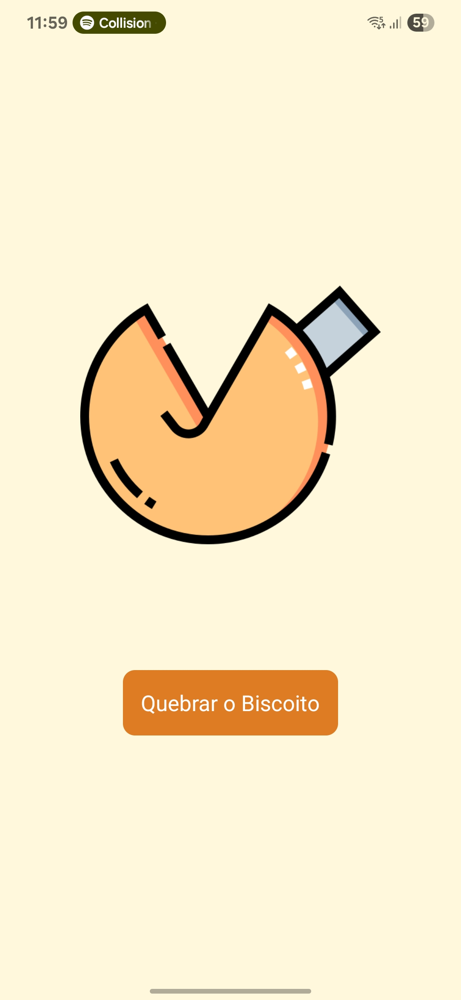
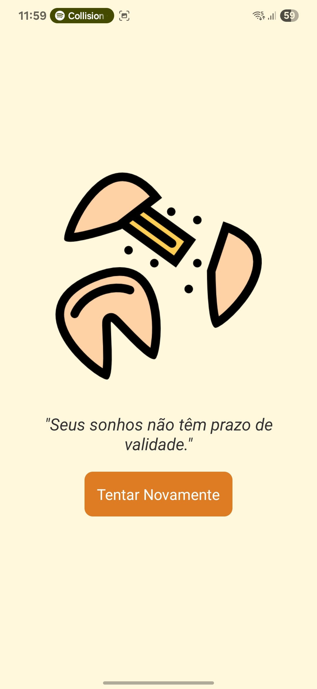
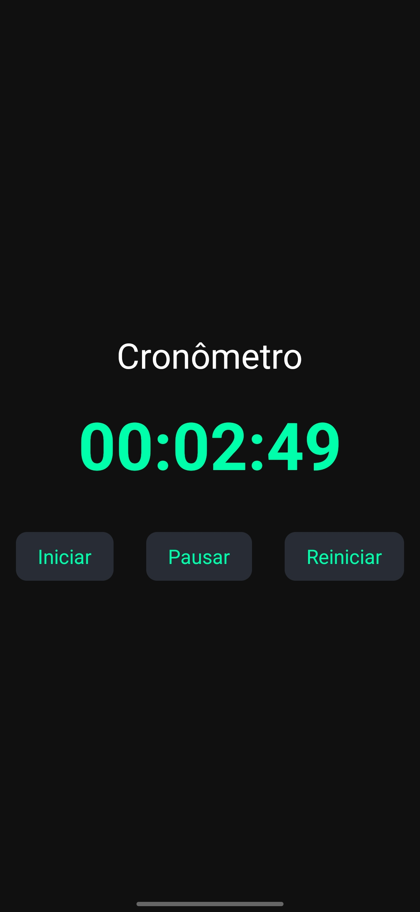
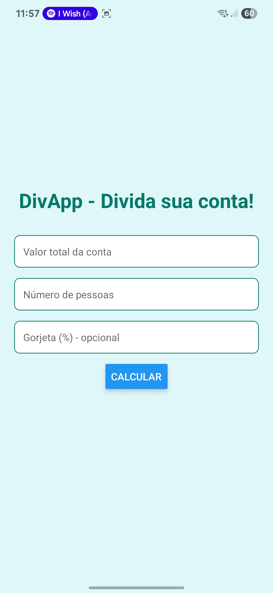
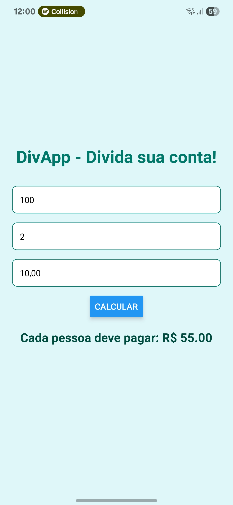

# Programação de APP - N2 AT2

## Fortune Cookie

## Cronometro

## DivApp

## Pré-requisitos
- Node 22+ instalado: [https://nodejs.org/en/download](https://nodejs.org/en/download)
- Android Studio instalado: [https://developer.android.com/studio?hl=pt-br&_gl=1*nl129j*_up*MQ..&gclid=Cj0KCQjwlYHBBhD9ARIsALRu09rxNPq228HpyHa7VIYhfOPEGxQ4mMm83XcsO_7C9YKHm55AMZW5zBAaAuEOEALw_wcB&gclsrc=aw.ds](https://developer.android.com/studio?hl=pt-br&_gl=1*nl129j*_up*MQ..&gclid=Cj0KCQjwlYHBBhD9ARIsALRu09rxNPq228HpyHa7VIYhfOPEGxQ4mMm83XcsO_7C9YKHm55AMZW5zBAaAuEOEALw_wcB&gclsrc=aw.ds)
- Expo Go instalado (opcional)

## Contribuição
Contribuições são bem-vindas! Se você tiver qualquer correção ou sugestões de melhorias, por favor, abra uma issue ou envie um pedido de pull request no repositório.

Ao contribuir com este projeto, por favor, mantenha o estilo de escrita dos códigos e envie as mudanças em um branch separado.